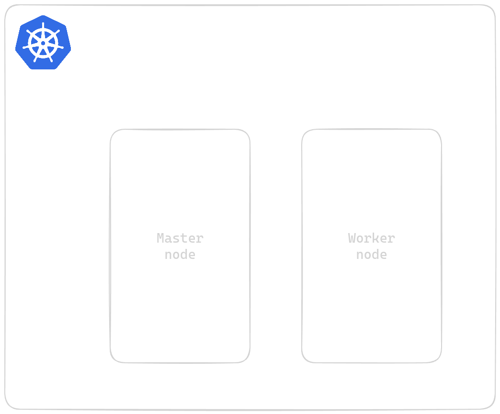

<style>
figcaption {
  color: #fff;
  text-align: center;
}
</style>

## Introduction

Running application generates a huge amount of logs. From the logs, we can say that the application is functioning well if most of them are information logs, or failing if they are stacktraces/errors. 

**Scenario:**

Let's say, a bank application user is trying to login to pay for a cup of coffee :) Every time she tried, it only shows "Login failed. Please try again!", even if her credentials are perfect. Not only this frustrates the user, but also the bank application administrators (usually, it's us, SRE team). After getting reports from users, the SRE team started to check the application backend and after several hours checking running services, they found the access control service returned so many of errors. They connected with stakeholders, and worked together to resolve the issue. Everything backed to normal. The users are now happy again.

But here's the thing: The SRE team had to go through all the services running in the Kubernetes cluster to find out that the access control service was malfunctioning. It did not stop and exited, but kept retrying indefinitely. If there's a tool which helps to centralizely store and visualize the logs from running services, the SRE team could take the rest much earlier.

**Solution:**

Here **Elastic** stack comes to rescue. The **Elastic** stack can be a good solution for the case as it is designed to store logs effectively and bring intuitive dashboards for log visualization.

This blog is a self-study lab, intends to share about Elastic stack's benefits, how it can be deployed, and the pros and cons of the stack. 

## Pre-requisite
The lab is performed under Linux environment using `kind` to create a local Kubernetes cluster with 2 nodes: 1 master and 1 worker. Each node has 2GB of storage so make sure your local machine has enough capabity. The following tools are required for this lab:
- kubectl
- kind
- Docker Engine

Readers should be familiar with the following knowledge:
- Docker concepts: Fundamental
- Kubernetes concepts: Intermediate
- Helm: Fundamental
- Linux: Intermediate
- (Optional) SSL/TLS: Intermediate

## Architecture overview

### Overview
Cluster overview:
<figure>
  
  <figcaption>Cluster architecture overview</figcaption>
</figure>

### Introduction to Elastic stack components
<figure>
  
  <figcaption>Elastic stack workflow</figcaption>
</figure>


- [Fluent Bit](https://docs.fluentbit.io/manual): A lightweight yet performance telemetry agent. In our architecture, Fluent Bit acts as a log collector and is deployed on every node to gather logs from running containers.
- [Logstash](https://www.elastic.co/guide/en/logstash/current/introduction.html): A data collector that accepts input from a variety of sources, and a powerful data processing pipeline with multiple filter plugins. In our architecture, Logstash accepts raw log output from Fluent Bit, transform the log into a structured format and then publish to Elasticsearch.
- [Elastic Search](https://www.elastic.co/guide/en/elasticsearch/reference/current/elasticsearch-intro.html): The heart of the Elastic stack. Elasticsearch is used to centralize, index, manage all the log and their lifecycles. By providing APIs, Elasticsearch allows developers to interact, search, and analyse the logs.
- [Kibana](https://www.elastic.co/guide/en/kibana/current/index.html): Not everyone loves to interact via APIs. In our architecture, Kibana provides a central place for anyone who needs access to Elasticsearch along with intuitive dashboards and customization options. 

## Laboratory

### Cluster setup
Every code or file in this blog is stored in [the blog resource repository](https://github.com/thai-nm/my-chirpy-website-resources/blob/main/2024-03-16-elastic-stack-a-complete-guide-to-set-up-a-modern-log-monitoring-system-on-kubernetes/).

Download and use the `kind` [config file](https://github.com/thai-nm/my-chirpy-website-resources/blob/main/2024-03-16-elastic-stack-a-complete-guide-to-set-up-a-modern-log-monitoring-system-on-kubernetes/kind.yaml) in the blog resource repository to create the desired cluster.

```bash
kind create cluster --config=kind.yaml
```
After running this command, you will have a Kubernetes cluster with 2 nodes running as 2 Docker containers.

### Set up Elasticsearch
- Set up ElasticSearch cluster
- Set up Kibana
- Set up Fluent Bit
- Set up Logstash

## Analysis: Pros and Cons
- About pros
- About cons
- Futher enhancement
- Q&A
  - Why this architecture?
  - Why don't we use only Fluent Bit?
  - Why not Elastic official Helm chart?

## Terminate lab resources

## Conclusion
- Here is the conclusion of the Elastic stack.

## Reference
- References to mentioned resources.
