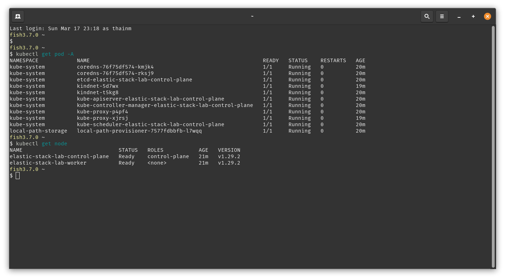

<style>
figcaption {
  color: #fff;
  text-align: center;
}
</style>

## Introduction

Running application generates a huge amount of logs. From the logs, we can say that the application is functioning well if most of them are information logs, or failing if they are stacktraces/errors. 

**Scenario:**

Let's say, a bank application user is trying to login to pay for a cup of coffee :) Every time she tried, it only shows "Login failed. Please try again!", even if her credentials are perfect. Not only this frustrates the user, but also the bank application administrators (usually, it's us, SRE team). After getting reports from users, the SRE team started to check the application backend and after several hours checking running services, they found the access control service returned so many of errors. They connected with stakeholders, and worked together to resolve the issue. Everything backed to normal. The users are now happy again.

But here's the thing: The SRE team had to go through all the services running in the Kubernetes cluster to find out that the access control service was malfunctioning. It did not stop and exited, but kept retrying indefinitely. If there's a tool which helps to centralizely store and visualize the logs from running services, the SRE team could take the rest much earlier.

**Solution:**

Here **Elastic** stack comes to rescue. The **Elastic** stack can be a good solution for the case as it is designed to store logs effectively and bring intuitive dashboards for log visualization.

This blog is a self-study lab, intends to share about Elastic stack's benefits, how it can be deployed, and the pros and cons of the stack. 

## Pre-requisite
The lab is performed under Linux environment using `kind` to create a local Kubernetes cluster with 2 nodes: 1 master and 1 worker. Each node has 2GB of storage so make sure your local machine has enough capabity. The following tools are required for this lab:
- [kubectl](https://kubernetes.io/docs/tasks/tools/install-kubectl-linux/)
- [kind](https://kind.sigs.k8s.io/docs/user/quick-start/#installation)
- [helm](https://helm.sh/docs/)
- [Docker Engine](https://docs.docker.com/engine/install/)

Readers should be familiar with the following knowledge:
- Docker concepts: Fundamental
- Kubernetes concepts: Intermediate
- Helm: Fundamental
- Linux: Intermediate
- (Optional) SSL/TLS: Intermediate

## Architecture overview

### Cluster overview
<figure>
  
</figure>

### Introduction to Elastic stack components
<figure>
  
</figure>


- [Fluent Bit](https://docs.fluentbit.io/manual): A lightweight yet performance telemetry agent. In our architecture, Fluent Bit acts as a log collector and is deployed on every node to gather logs from running containers.
- [Logstash](https://www.elastic.co/guide/en/logstash/current/introduction.html): A data collector that accepts input from a variety of sources, and a powerful data processing pipeline with multiple filter plugins. In our architecture, Logstash accepts raw log output from Fluent Bit, transform the log into a structured format and then publish to Elasticsearch.
- [Elastic Search](https://www.elastic.co/guide/en/elasticsearch/reference/current/elasticsearch-intro.html): The heart of the Elastic stack. Elasticsearch is used to centralize, index, manage all the log and their lifecycles. By providing APIs, Elasticsearch allows developers to interact, search, and analyse the logs.
- [Kibana](https://www.elastic.co/guide/en/kibana/current/index.html): Not everyone loves to interact via APIs. In our architecture, Kibana provides a central place for anyone who needs access to Elasticsearch along with intuitive dashboards and customization options. 

## Laboratory

### Cluster setup
Every code or file in this blog is stored in [the blog resource repository](https://github.com/thai-nm/my-chirpy-website-resources/blob/main/2024-03-16-elastic-stack-a-complete-guide-to-set-up-a-modern-log-monitoring-system-on-kubernetes/).

- Download and use the [kind.yaml file](https://github.com/thai-nm/my-chirpy-website-resources/blob/main/2024-03-16-elastic-stack-a-complete-guide-to-set-up-a-modern-log-monitoring-system-on-kubernetes/kind.yaml) in the blog resource repository to create the desired cluster.

  ```bash
  # Create lab cluster
  kind create cluster --config=kind.yaml

  # Update kubectl to access lab cluster
  kubectl cluster-info --context kind-elastic-stack-lab
  ```

- You should have a Kubernetes cluster with 2 nodes running as 2 Docker containers now. Let's run this command to check and create `observability` namespace for our resources:
  ```bash
  # Check status of pods in every namespace
  kubectl get pod -A

  # Check status of cluster nodes
  kubectl get node

  # Create `observability` namespace
  kubectl create namespace observability
  ```

  The output should look similar to this:
  <figure>
    
  </figure>

- We will set up Elastic stack by using Helm charts provided by Bitnami. Add Bitnami chart repository to Helm and try to list available charts:
  ```bash
  # Add Bitnami chart repo
  helm repo add bitnami https://charts.bitnami.com/bitnami
  
  # List available charts
  helm search repo bitnami
  ```

  The output should look like this:
  

Now we're good to go, let's start provisioning!

### Set up Elasticsearch
By default, this chart will install `Elasticsearch` as a `StatefulSet` object. This `StatefulSet` will control 4 types of [Elasticsearch node](https://www.elastic.co/guide/en/elasticsearch/reference/current/modules-node.html), with each node is represented by a `Pod`:
  - Master node
  - Ingest node
  - Data node
  - Coordinating node

We can install Elasticsearch using chart's default values. But we still need to overide some values to fit our demo purpose. The [values-elasticsearch.yaml](https://github.com/thai-nm/my-chirpy-website-resources/blob/main/2024-03-16-elastic-stack-a-complete-guide-to-set-up-a-modern-log-monitoring-system-on-kubernetes/values-elasticsearch.yaml) file can be a good start for our use case, as well as for development/staging environments in practical:
```yaml
---
security:
  enabled: true                         # [1]
  existingSecret: elasticsearch-admin   # [2]
  tls:
    autoGenerated: true                 # [3]
    restEncryption: false               # [4]
master:                                 # [5]
  replicaCount: 1
  persistence:
    size: 2Gi
  resources:
    requests:
      cpu: 500m
      memory: 512Mi
    limits:
      cpu: 750m
      memory: 768Mi
data:                                   # [6]
  replicaCount: 2
  persistence:
    size: 5Gi
  resources:
    requests:
      cpu: 500m
      memory: 512Mi
    limits:
      cpu: 750m
      memory: 1524Mi
coordinating:                           # [7]
  replicaCount: 1
  persistence:
    size: 2Gi
  resources:
    requests:
      cpu: 500m
      memory: 512Mi
    limits:
      cpu: 750m
      memory: 768Mi
ingest:                                 # [8]
  enabled: false
```

Let's explain those options:
  1. We enable [X-Pack security plugin](https://www.elastic.co/guide/en/elasticsearch/reference/current/security-basic-setup.html) for our Elasticsearch cluster. With this option enabled, any node wants to join our cluster will need to be verified by TLS certificates, which are automatically generated by [3]. Also, API requests to our Elasticsearch server will requires user authentication. This means every request will need to specify an authenticated user and password.
  2. By default, Elasticsearch has a built-in user with `admin` role named `elastic`. This option will use the existing secret `elasticsearch-admin` as the password for the `elastic` built-in user. The Elasticsearch chart does provide us an option to specify a raw string as the `elastic` user password, but this is discouraged as we shouldn't store any kind of password as raw string or in our source code. Instead, we should create a secret separately using Kubernetes Secret object, and use this `existingSecret` option to specify the created Secret object. The command below will create the `elasticsearch-admin` Secret contains `elasticadmin` as the password:
  ```bash
  kubectl create secret generic elasticsearch-admin --from-literal=elasticsearch-password=elasticadmin --namespace observability
  ```
  3. Enable auto generation of TLS certificates which are required for Elasticsearch node communication. The TLS certificates will be created and distributed to nodes managed by this chart automatically.
  4. Disable TLS encryption for REST requests from clients to our Elasticseach server. Because all of the client components in this lab such as Logstash and Kibana are installed within the same cluster with the Elasticsearch server, the communication between them and Elasticsearch can be HTTP. For other use cases, such as client applications communicate with the Elasticsearch server over the Internet, TLS encryption must be required.
  5. These are options for the `master` nodes. We will install one `master` node with 2Gi of storage.. Other options are Kubernetes resource request and limitation.
  6. These are options for the `data` nodes. We will install 2 `data` nodes, each has 5Gi of storage. Other options are Kubernetes resource request and limitation.
  7. These are options for the `coordinating` nodes. We will install 1 `coordinating` nodes, each has 2Gi of storage. Other options are Kubernetes resource request and limitation.
  8. Disabled creation of `ingest` nodes.

Install Elasticsearch in `observability` namespace:
```bash
helm install lab-elasticsearch bitnami/elasticsearch --values values-elasticsearch.yaml --version 19.12.2 --namespace observability
```

The following commands are used to check if everything goes well:
```bash
# Port forward Elasticsearch Service to local machine port
kubectl port-forward -n observability services/lab-elasticsearch 9200:9200

# Open a new terminal. Check Elasticsearch status
kubectl get pod -n observability

# Check if we can connect to Elasticsearch
curl -u elastic:elasticadmin http://localhost:9200
```

The output should look like this:


References:
  - [Source repository](https://github.com/bitnami/charts/tree/main/bitnami/elasticsearch)
  - [ArtifactHub](https://artifacthub.io/packages/helm/bitnami/elasticsearch)

### Set up Kibana
We just have Elasticsearch deployed, let's install Kibana as a front-end of the Elasticsearch using the [values-kibana.yaml](https://github.com/thai-nm/my-chirpy-website-resources/blob/main/2024-03-16-elastic-stack-a-complete-guide-to-set-up-a-modern-log-monitoring-system-on-kubernetes/values-kibana.yaml) file:

```yaml
kibana:
  resources:                                              # [1]
    requests:
      cpu: 1
      memory: 512Mi
    limits:
      cpu: 2
      memory: 1024Mi
  # tls:
  #   enabled: false
  elasticsearch:
    hosts:
      - elasticsearch.observability.svc.cluster.local     # [2]
    port: 9200                                            # [3]
    security:                                             # [4]
      auth:
        enabled: true
        elasticsearchPasswordSecret: elasticsearch-admin
```

Let's review our configurations:
  1. Specify compute resources for our Kibana instance.
  2. Specify our Elasticsearch host name. As we are deploying the Elastic stack within the same cluster, the host name is the fully qualified domain name or [FQDN](https://github.com/thai-nm/my-chirpy-website-resources/blob/main/2024-03-16-elastic-stack-a-complete-guide-to-set-up-a-modern-log-monitoring-system-on-kubernetes/values-elasticsearch.yaml) of the Elasticsearch Service.
  3. Port number that the Elasticsearch listens for incoming requests. With the installation of Elasticsearch above, this is `9200` by default.
  4. Configure security options when Kibana communicates with Elasticsearch. Here we are telling Kibana that Elasticsearch has enabled the security plugin, which requires any clients to have a username and password to communicate. Then we provide the password Secret object `elasticsearch-admin` so that Kibana can use it as the credential to talk to Elasticsearch.

Install our Kibana:
```bash
helm install lab-kibana bitnami/kibana --values values-kibana.yaml --namespace observability
```

### Set up Fluent Bit
- Set up Fluent Bit

### Set up Logstash
- Set up Logstash

## Analysis: Pros and Cons
- About pros
- About cons
- Futher enhancement
- Best practices
- Q&A
  - Why this architecture?
  - Why don't we use only Fluent Bit?
  - Why not Elastic official Helm chart?

## Terminate lab resources

## Conclusion
- Here is the conclusion of the Elastic stack.

## Reference
- References to mentioned resources.
