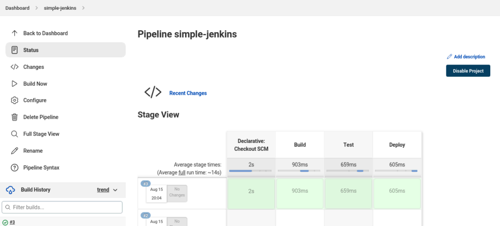
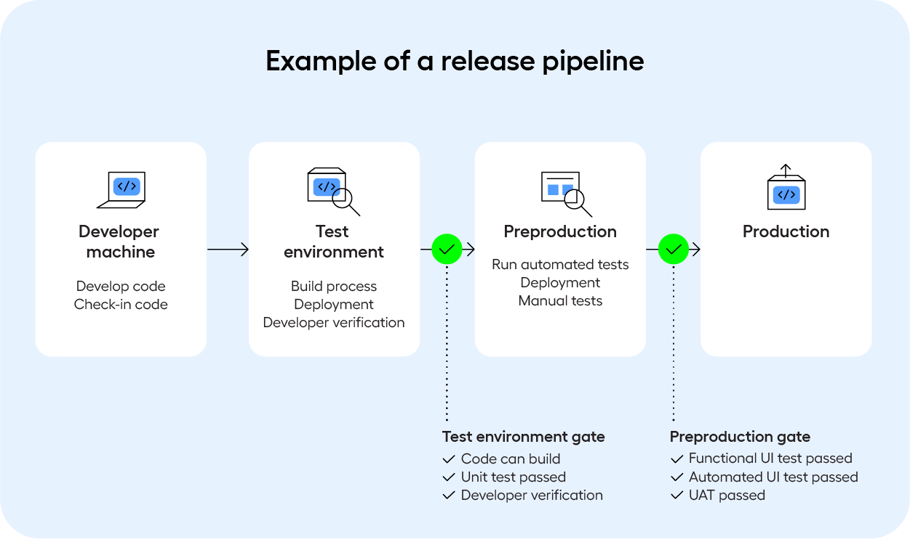

## Giới thiệu
Chào các bạn, đây là bài viết đầu tiên của mình về DevOps 😃

Sau một hồi đắn đo trong việc lên ý tưởng cho bài viết này, mình quyết định chọn cách trả lời cho một câu hỏi, có lẽ đã xuất hiện trong đầu của bất cứ ai theo đuổi vị trí này: `DevOps là gì?`


Bài viết được trình bày dưới góc nhìn chủ quan của mình, với 3 năm kinh nghiệm làm DevOps Engineer tại 1 công ty outsourcing và mới chuyển sang 1 công ty product gần đây.

Mục đích của bài viết:
- Chia sẻ quan điểm tới cộng đồng.
- Dành cho các bạn quan tâm và muốn tìm hiểu về DevOps: Mình mới ra trường chưa lâu, và mình muốn nhân lúc còn nhớ những băn khoăn, thắc mắc khi lơ mơ nghe tới DevOps, mình có thể chia sẻ tới các bạn (đặc biệt là sinh viên), mong rằng có thể phần nào giúp các bạn hiểu rõ hơn.  
- Viết cho mình trong tương lai. Mình khá tò mò không biết vài năm nữa góc nhìn của mình liệu có thay đổi gì hay không 😃

Lan man thế đủ rồi, vào vấn đề thoi 😃 

## DevOps là gì?
Trong quy trình phát triển phần mềm, bằng việc liên tục đưa ra các bản cập nhật mới với từng thay đổi nhỏ của ứng dụng thay vì lên kế hoạch với timeline dài dằng dặc cùng nhiều thay đổi lớn, đội ngũ phát triển sẽ nhận được phản hồi từ phía khách hàng/người dùng sớm hơn, đồng nghĩa với việc sớm có kế hoạch thay đổi code hoặc đưa ra các bản vá lỗi/cải tiến. Ngoài ra, các thay đổi nhỏ nếu có gây ra lỗi thường sẽ dễ xử lý hơn các thay đổi lớn. Để đáp ứng được việc liên tục đưa ra các bản cập nhật mới như vậy, ta cần một cách thức nào đó giúp __giảm thời gian__ đưa sản phẩm tới tay người dùng mà vẫn __giữ được chất lượng tốt__, và ta có: __DevOps__.

Khi tra định nghĩa DevOps trên Google, rất có thể các bạn đã bắt gặp định nghĩa kiểu như: "DevOps là một văn hoá/phương thức/nguyên lý ...". Các định nghĩa này theo mình đều đúng, nhưng trừu tượng và khó hình dung cho người đọc, đặc biệt với những người mới tìm hiểu về DevOps. Trong bài viết này, mình đưa ra định nghĩa của mình về DevOps engineer, điều mà mình cho là thực tế và rõ ràng hơn. 

DevOps engineer là những người:
- __Tự động hoá việc triển khai với việc phát triển ứng dụng__: Thông thường ở một dự án phát triển phần mềm, ứng dụng sẽ được triển khai tới từng môi trường tương ứng với từng giai đoạn: `dev -> qa -> staging -> production`. Thay vì deploy (triển khai) thủ công trên từng môi trường mỗi khi có yêu cầu, việc tự động deploy (thường bằng CI/CD pipeline) giúp giảm thời gian thao tác, hạn chế rủi ro khi làm thủ công (con người làm có thể gây ra lỗi, càng làm nhiều thì khả năng gây ra lỗi càng lớn, và lỗi thì cần thời gian để sửa 😃). 

    Ví dụ: Team QA cần service `user-management-service` trên môi trường `QA` để chạy test. Sử dụng các CI/CD platform như [Jenkins](https://www.jenkins.io/) hay [GitHub Actions](https://github.com/features/actions), QA engineer chỉ việc chọn service cần triển khai và ấn nút `Deploy`, đợi vài phút (thường là vậy 😁) cho pipeline chạy xong là sẽ có service `user-management-service` trên môi trường `QA` để cả team tha hồ test. Các pipeline tự động deploy này không tự dưng có, mà sẽ được team DevOps phát triển.

     <em>Một CI/CD pipeline trên Jenkins</em>

- __Quản lý cơ sở hạ tầng (infrastructure)__: Như đã đề cập ở trên, mỗi dự án sẽ có nhiều môi trường. DevOps là những người tạo/cập nhật/xoá infrastructure như máy chủ (server), database trên các môi trường. Nếu mỗi môi trường lại phải quản lý thủ công thì sẽ mất rất nhiều thời gian (và chán), đồng thời tiềm ẩn nhiều rủi ro, xoá nhầm hay cấu hình sai một database chẳng hạn. Lúc này, tự động hoá việc thao tác với hệ thống là rất cần thiết, và ta có [Terraform](https://www.terraform.io/) được sử dụng rộng rãi, giúp ta cấu hình server, database hay infrastructure nói chung thông qua code.

    Dưới đây là một đoạn code Terraform để tạo một VM (virtual machine) trên AWS:
    ```terraform
    provider "aws" {
        region = "us-east-1"
    }

    resource "aws_instance" "terraform_vm" {
        ami           = "ami-0c55b159cbfafe1f0"
        instance_type = "t2.micro" 

        tags = {
            Name = "Terraform-VM"
        }
    }

    output "instance_ip" {
        description = "Public IP of the  instance"
        value       = aws_instance.terraform_vm.public_ip
    }
    ```

- __Giám sát (monitoring) và khắc phục sự cố hệ thống__: Giả sử ứng dụng của mình đột nhiên được biết đến rộng rãi, nhà nhà người người tải xuống và dùng khiến lượng request tăng cao đột biến, mình cần phải tăng CPU/memory cho database để có thể chịu tải được. Để nhận biết được điều này sớm, cần có những phương án hay công cụ để theo dõi được tình trạng hệ thống ứng dụng, và mình có thể tìm tới combo ngon bổ miễn phí [Prometheus](https://prometheus.io/) kết hợp với [Grafana](https://grafana.com/). Tất nhiên, cái này DevOps làm nốt 😁.

     <em> Dashboard trên Grafana </em>

Trên thực tế, team DevOps làm việc rất chặt chẽ với các team khác như:
- __Team backend/frontend (a.k.a team dev)__: DevOps engineer là người chịu trách nhiệm chính trong việc deploy ứng dụng, mỗi ứng dụng lại cần cấu hình và cài đặt khác nhau nên DevOps engineer cần làm việc trực tiếp với team dev để nắm được ứng dụng cần gì để build được và chạy được.
- __Team tester và QA__: DevOps engineer làm việc cùng với team tester và QA để hiểu và đưa việc chạy test như unit test, smoke test, integration test vào trong các pipeline để tự động hoá việc chạy các loại test này. Các test mà team tester tạo ra có thể được chạy riêng biệt hoặc cùng với pipeline để deploy ứng dụng. Một ví dụ đơn giản là chỉ khi pass test case A thì ứng dụng mới được deploy lên môi trường staging, và sau khi ứng dụng đã được deploy này pass test case B thì mới được deploy lên môi trường production.

     <em> Hình minh hoạ về quy trình của một automation test pipeline </em>

- __Team IT__: Ở một số công ty, team IT quản lý cấu hình về mạng nội bộ, server vật lý nội bộ và hệ thống quản lý quyền truy cập (Active Directory) của nhân viên trong công ty. Team DevOps phối hợp với team IT để làm những nhiệm vụ như sử dụng Active Directory của công ty để kết nối tới các bên thứ ba cung cấp dịch vụ (Azure, AWS, ...), từ đó cho phép nhân viên dùng thông tin tài khoản của công ty để truy cập các dịch vụ của các bên này.

Và còn làm việc với rất nhiều vị trí khác nữa.

## Công việc hàng ngày của DevOps engineer
Bắt nguồn từ những trách nhiệm kể trên, một ngày làm DevOps engineer của mình thường gồm những đầu việc như:
- Theo dõi hệ thống và xử lý sự cố: team dev không gọi được API của service A trên môi trường `staging` do lỗi hệ thống mạng; ứng dụng bị crash liên tục do không kết nối được tới database, ...
- Phát triển pipeline để tự động hoá và tích hợp thêm chức năng mới: Thêm bước lưu kết quả các test case thành file `.zip` và cho phép tải về; thêm bước yêu cầu xác nhận thủ công của sếp trước khi deploy lên môi trường `production`; ...
- Bảo trì hệ thống và nâng cao bảo mật: nâng version của Jenkins server lên bản mới nhất để nhận những bản vá bảo mật (security patch) mới nhất; chuyển từ cấp toàn bộ quyền cho một người thành chỉ cấp những quyền cần thiết, thiếu thì yêu cầu xin thêm; ...
- Quản lý infrastructure: Tạo một database cho môi trường dev; tự động tắt server ngoài giờ làm việc để giảm chi phí; ...
- ...

Các bạn có thể tham khảo thêm các job description (JD) trên mạng để nắm được về yêu cầu và công việc của DevOps engineer, ví dụ như [đây](https://business.linkedin.com/talent-solutions/resources/how-to-hire-guides/devops-engineer/job-description) là một JD mẫu trên Linkedin.


## Thách thức và cơ hội
placeholder

## FAQ thường thấy
- Roadmap?
- Lương cao không?
- Cạnh tranh và làn sóng AI?
- Làm DevOps có phải code không?
- DevOps 

## Tham khảo
- Agile
- Quy trình phát triển phần mềm
- DevOps